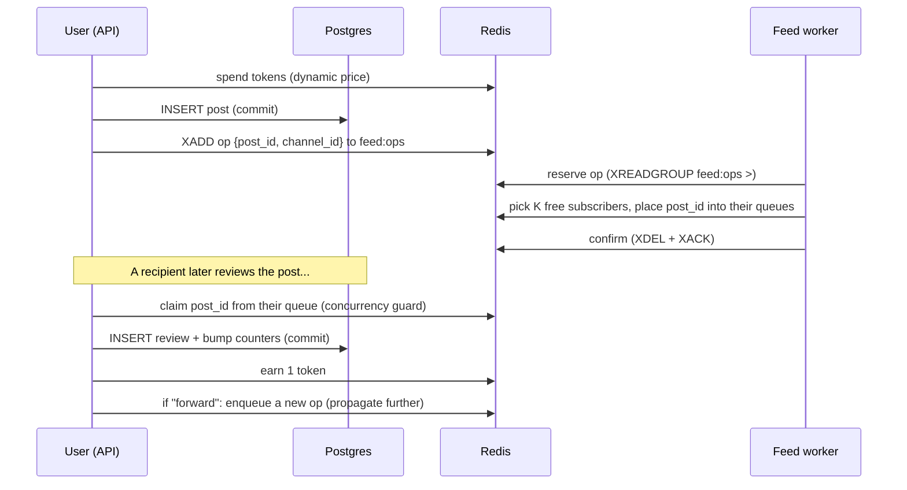

# Poulse Kora Backend

## Features

- FastAPI
- React Admin
- SQLAlchemy and Alembic
- Pre-commit hooks (black, autoflake, isort, flake8, prettier)
- Github Action
- Dependabot config
- Docker images

## Good to know

The frontend of this project uses React Admin. Follow the quick tutorial to understand how [React Admin](https://marmelab.com/react-admin/Tutorial.html) works.

## The feed algorithm

This is the heart of the backend and the thing to understand first. Skim this section
before touching anything under `app/feed/`.

### Why two data stores

The feed is distributed across **Postgres** and **Redis** by design:

- **Postgres is the source of truth.** It holds the actual objects: users (with
  denormalized `reviewed/forwarded/dropped` counters), channels, posts, post reviews
  (one row per `(user, post)`, uniquely constrained), and channel subscriptions.
- **Redis holds distribution *state*, never content.** It stores only `post_id`s and
  `user_id`s in the structures that decide _who sees which post next_. This is what makes
  the feed cheap to read and to fan out. Computing each user's feed on demand in Postgres
  (join subscriptions × posts × reviews, filter, order, paginate) is exactly the query
  that doesn't scale; precomputing it in Redis (fan-out-on-write) avoids that.

Everything in Redis is either derivable from Postgres (and rebuildable — see
`rebuild_redis.py`) or durable via Redis AOF. Postgres never depends on Redis.

### Redis key catalogue

| Key | Type | Holds |
| --- | --- | --- |
| `queue:{user_id}` | list | A user's review queue — up to `FEED_QUEUE_MAX_SLOTS` `post_id`s awaiting forward/drop. |
| `free_queue` | set | `user_id`s whose queue has at least one free slot (i.e. reachable by fan-out). |
| `channel:{channel_id}` | set | Subscriber `user_id`s for a channel. |
| `tokens:{user_id}` | int | Spendable token balance (the posting throttle — see below). |
| `feed:ops` | stream | Fan-out jobs (fields `post_id`/`channel_id`), consumed by a group. |
| `feed:workers` | consumer group | The group over `feed:ops`; every worker joins it under a distinct consumer name. |
| `ops:retry` | sorted set | Undeliverable ops parked until due (score = ready-at unix ts). |

Multi-step state changes that must be atomic are done with small Lua scripts
(`app/feed/scripts.py`): `spend` (check-and-decrement tokens), `place` (push into a queue
+ drop from `free_queue` when full), `claim` (remove from a queue + re-add to `free_queue`
when a slot frees), `ensure_free` (add to `free_queue` iff the queue has room).

### Lifecycle of a post



**1. Create** (`POST /posts`, `app/api/posts.py:create_post`). Price is computed from the
current outstanding op count (`XLEN feed:ops`) —
`clamp(FEED_PRICE_MIN + len // FEED_PRICE_STEP_ITEMS, FEED_PRICE_MIN, FEED_PRICE_MAX)` — so
posting gets more expensive as the system gets busier. Superusers post free; everyone else
spends tokens atomically (HTTP 402 if broke). The post is written to Postgres, then an op is
`XADD`ed to `feed:ops` for the workers.

**2. Fan-out** (`app/feed/worker.py`). Each worker process joins the `feed:workers` consumer
group under its own name and loops: reclaim abandoned ops (`XAUTOCLAIM`) → reschedule due
retries → read + process one op (`XREADGROUP … >`). Processing = pick up to `FEED_FANOUT`
recipients and `place` the `post_id` into each of their queues, then retire the entry
(`XDEL` + `XACK`). Recipient selection (`service.select_recipients`) is
**sample-then-filter**: `SRANDMEMBER` a bounded random sample of the channel's subscribers
(`FEED_FANOUT × FEED_FANOUT_SAMPLE_MULTIPLIER`), then keep those in `free_queue` via one
`SMISMEMBER`. Both calls are O(sample), independent of channel size — no per-op set
intersection over the whole channel. If no sampled subscriber is free, the op is parked in
`ops:retry` (see Retries). Because each entry goes to exactly one consumer in the group,
**you can run several workers to share fan-out load** (see Crash safety).

**3. Read the feed** (`GET /posts/feed`). Just `LRANGE queue:{user}` for the `post_id`s,
then hydrate them from Postgres in one `WHERE id IN (...)`. Ordering/materialization is
already done in Redis.

**4. Review** (`POST /posts/{id}/review`). Forward or drop. `claim_from_queue` removes the
post from the user's queue first — **this is the concurrency guard** (a post can only be
reviewed while it's in the queue; 409 `not_in_queue` otherwise). Then the review row +
counter bumps commit in Postgres (a duplicate delivery hits the unique constraint → 409
`already_reviewed`, harmless). Reviewing earns **1 token**; a **forward** enqueues a fresh
op so the post propagates to more users, a **drop** ends its journey for that user.

**5. Subscribe / unsubscribe** (`app/api/channels.py`). Subscribe mirrors into Redis
(`SADD channel:{id}`, ensure the user is in `free_queue`) and **backfills** the queue with
recent un-reviewed posts so a new subscriber sees content immediately (live posts only
arrive via fan-out _after_ subscribing). Unsubscribe removes the channel-set membership;
already-queued posts are left in place.

### The token economy

Tokens are a **posting throttle, not a durable currency.** A new account starts with
`FEED_STARTING_TOKENS` (see `app/core/config.py`) so signing up is enough to publish a first
post; after that, you earn 1 per review and spend a congestion-scaled price to post — when the
system is busy, posting costs more and requires more reviewing to afford. Balances live only in
Redis and are **not** journaled in Postgres — `rebuild_redis.py` reseeds them from
`FEED_STARTING_TOKENS + reviewed_count`, so a rebuild discards spend history but keeps the
starting grant. That's acceptable precisely because tokens are friction, not money. Don't build
product features that assume the balance is authoritative or persistent.

### Crash safety & scaling (Streams consumer group)

The operation queue is a **Redis Stream** (`feed:ops`) consumed by a **consumer group**
(`feed:workers`). A worker **reserves** an op with `XREADGROUP … >` (it enters the group's
pending list), does the fan-out, then **confirms** with `XDEL` + `XACK`. If the process dies
or the iteration errors mid-fan-out, the op stays *pending and unacked* rather than being
lost. Each loop, `reclaim_orphaned_operations` runs `XAUTOCLAIM`, which reassigns any entry
idle longer than `FEED_STREAM_CLAIM_MIN_IDLE_MS` to a live worker, which re-processes it.

Two properties fall out of using the group:

- **Horizontally scalable.** Every worker process joins the group under a unique consumer
  name (`hostname:pid:rand`), and the group delivers each entry to exactly one of them — so
  running several workers **shares** the fan-out load. This is the intended scaling path;
  correctness no longer depends on there being a single consumer.
- **Crash-safe with N workers.** Reclaim is keyed on *idle time*, not on "only one consumer
  exists", so an op another worker is actively processing (recently delivered) is never
  stolen — only genuinely abandoned ones are.

Delivery is **at-least-once**: a reclaimed, partially-done op re-delivers to some recipients.
That's already tolerated — duplicate delivery is deduped at review time by the unique
`(user, post)` constraint. Completed entries are `XDEL`'d, so the stream **self-trims** to
outstanding work; no separate trim janitor is needed, and `XLEN` stays a fair congestion
signal for pricing.

> ℹ️ Sizing: `FEED_STREAM_CLAIM_MIN_IDLE_MS` must exceed the worst-case time to fan out one
> op, or a slow (not crashed) op gets reclaimed and processed twice. Duplicates are
> tolerated, so this is a waste knob, not a correctness one.

### Retries

An op with no currently-free recipient is parked in `ops:retry` (a sorted set scored by
ready-at time) rather than spun in a tight loop or discarded. Each loop the worker re-adds
due entries to `feed:ops` (`XADD`). Members are prefixed with a random id so two stalled
attempts for the same `(post, channel)` don't collide into one entry. Streams are
append-only, so a re-added retry goes to the tail (not ahead of newer work as the old list
did) — a cosmetic ordering change. Tune the wait with `FEED_RETRY_INTERVAL_SECONDS`.

### Rebuild / reconcile

`rebuild_redis.py` (→ `service.rebuild_from_pg`) repopulates the **derivable** Redis state
from Postgres: channel subscriber sets, `free_queue`, token balances (from `reviewed_count`),
and per-user queue backfills. It does **not** touch `feed:ops` / `ops:retry` (those aren't
derivable and rely on AOF). Idempotent — safe to re-run after a Redis flush or a Postgres
restore. See the "Seed dev data" section for the commands.

### Config knobs (`app/core/config.py`)

| Setting | Default | Meaning |
| --- | --- | --- |
| `FEED_QUEUE_MAX_SLOTS` | 20 | Per-user review-queue capacity; a full user leaves `free_queue`. |
| `FEED_FANOUT` | 3 | Recipients (K) each op delivers to. |
| `FEED_FANOUT_SAMPLE_MULTIPLIER` | 4 | Selection samples `K × this` subscribers before filtering to free ones. |
| `FEED_PRICE_MIN` / `FEED_PRICE_MAX` | 1 / 5 | Bounds of the dynamic posting price. |
| `FEED_PRICE_STEP_ITEMS` | 20 | Price rises by 1 per this many outstanding ops. |
| `FEED_RETRY_INTERVAL_SECONDS` | 20 | How long an undeliverable op waits before retry. |
| `FEED_STREAM_CLAIM_MIN_IDLE_MS` | 30000 | Idle time before a pending op may be reclaimed by another worker. |
| `FEED_STREAM_RECLAIM_COUNT` | 10 | Max abandoned ops pulled back per reclaim sweep. |
| `FEED_STREAM_BLOCK_SECONDS` | 1.0 | How long each `XREADGROUP` blocks waiting for a new op. |

### Known limitations / sharp edges

Worth knowing before you extend this — none are blocking for the MVP but each is a real trap:

- **Dual writes aren't transactional.** Create does `spend (Redis) → commit post (PG) →
  XADD op (Redis)` with no cross-store transaction. A crash between the PG commit and the
  `XADD` leaves a post that existing subscribers never receive (a later new subscriber
  would still pick it up via backfill). There is no refund/compensation path.
- **Tokens are non-durable** (see above) — by design, but don't rely on them.
- **Unsubscribe leaves queued posts** reviewable; `review_post` doesn't re-check
  subscription, so a user who left a channel can still forward/drop its already-queued posts.
- **Deleting a post/user/channel doesn't clean Redis.** There's no delete endpoint yet, but
  ghost `post_id`s in queues (post deleted) or orphaned sets (user/channel deleted) would
  linger and could occupy queue slots.
- **`GET /posts/feed?channel_id=` filters after pagination** — it fetches `limit` queue
  entries then filters by channel in Python, so a per-channel view can under-return.
- **Saturated channels degrade to retry.** If free subscribers are rare enough that the
  random sample misses them, the op parks for retry — correct, but latency-y. Raise
  `FEED_FANOUT_SAMPLE_MULTIPLIER` if this bites.
- **Dead consumer names linger.** A crashed worker's consumer name stays in the group's
  metadata (its pending ops are reclaimed, but the empty consumer remains). Harmless, but an
  occasional `XGROUP DELCONSUMER` sweep keeps `XINFO CONSUMERS` tidy.

## Step 1: Getting started

Start a local development instance with docker compose

```bash
docker compose up -d

# Run database migration
docker compose exec backend alembic upgrade head

# Create database used for testing
docker compose exec postgres createdb apptest -U postgres
```

Now you can navigate to the following URLs:

- Backend OpenAPI docs: http://localhost:8000/docs/
- Frontend: http://localhost:3000

### Step 2: Setup pre-commit hooks and database

Keep your code clean by using the configured pre-commit hooks. Follow the [instructions here to install pre-commit](https://pre-commit.com/). Once pre-commit is installed, run this command to install the hooks into your git repository:

```bash
pre-commit install
```

### Local development

The backend setup of docker compose is set to automatically reload the app whenever code is updated. However, for frontend it's easier to develop locally.

```bash
docker compose stop frontend
cd frontend
yarn
yarn start
```

If you want to develop against something other than the default host, localhost:8000, you can set the `REACT_APP_API_BASE` environment variable:

```bash
export REACT_APP_API_BASE=http://mydomain.name:8000
yarn start
```

Don't forget to edit the `.env` file and update the `BACKEND_CORS_ORIGINS` value (add `http://mydomain:3000` to the allowed origins).

### Rebuilding containers

If you add a dependency, you'll need to rebuild your containers like this:

```bash
docker compose up -d --build
```

### Resetting the local environment

To wipe Postgres and Redis completely and start from a clean slate (e.g. local state got
into a bad shape), tear the containers down along with their volumes and bring everything
back up:

```bash
docker compose down -v
docker compose up -d
docker compose exec backend alembic upgrade head
docker compose exec postgres createdb apptest -U postgres
```

`down -v` removes the `app-db-data` and `redis-data` volumes, so both come back empty.
Re-run `seed_dev_data.py` afterwards (see below) if you want dev data back.

### Regenerate front-end API package

Instead of writing frontend API client manually, OpenAPI Generator is used. Typescript bindings for the backend API can be recreated with this command:

```bash
yarn genapi
```

### Database migrations

These two are the most used commands when working with alembic. For more info, follow through [Alembic's tutorial](https://alembic.sqlalchemy.org/en/latest/tutorial.html).

```bash
# Auto generate a revision
docker compose exec backend alembic revision --autogenerate -m 'message'

# Apply latest changes
docker compose exec backend alembic upgrade head
```

### Backend tests

The `Backend` service uses a hardcoded database named `apptest`. First, ensure that it's created

```bash
docker compose exec postgres createdb apptest -U postgres
```

Then you can run tests with this command:

```bash
docker compose run backend pytest --cov --cov-report term-missing
```

### Seed dev data

`seed_dev_data.py` creates a handful of fixed "bot" users and tops up every channel with a
few realistic posts from them, then reconciles the Redis feed state (channel subscriber
sets, free-queue, token balances, and per-user review queues) from Postgres. This gives a
real dev/mobile-app account something to review as soon as it subscribes to a channel via
the app — `get_posts_feed` excludes posts authored by the viewer, so a single real account
would otherwise never see anything in its own feed.

```bash
docker compose exec backend python seed_dev_data.py
```

Safe to re-run: bot users are matched by email, and each channel is only topped up to a
fixed number of bot posts, so re-running won't pile up duplicates.

If Redis distribution state ever drifts from Postgres on its own (e.g. after manually
flushing Redis, or restoring a Postgres backup without matching Redis data), reconcile it
directly without creating any new posts:

```bash
docker compose exec backend python rebuild_redis.py
```

### Info banner

`set_banner.py` pushes (or clears) the announcement shown as a compact banner in the mobile
app on launch — e.g. a maintenance downtime notice. It's stored in Redis with no TTL, so it
stays until explicitly replaced or cleared, and bypasses the superuser-guarded API entirely
so it can be run from a terminal without minting a JWT.

```bash
docker compose exec backend python set_banner.py "maintenance downtime tonight 10pm-midnight"
docker compose exec backend python set_banner.py --clear
```

Each call to set the banner gets a fresh id, so pushing a new message always reaches clients
that previously chose "don't show again" on an older one — even if the text repeats.

### Single docker image

There's a monolith/single docker image that uses FastAPI to serve static assets. You can use this image to deploy directly to Heroku, Fly.io or anywhere where you can run a Dockerfile without having to build a complicated setup out of separate frontend and backend images.

## Recipes

#### Build and upload docker images to a repository

Configure the [**build-push-action**](https://github.com/marketplace/actions/build-and-push-docker-images) in `.github/workflows/test.yaml`.

## Credits

Created with [FastAPI Starter](https://github.com/gaganpreet/fastapi-starter)
